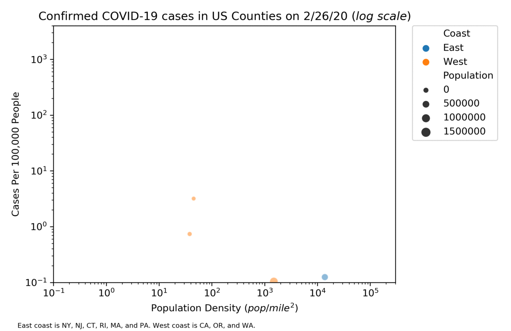
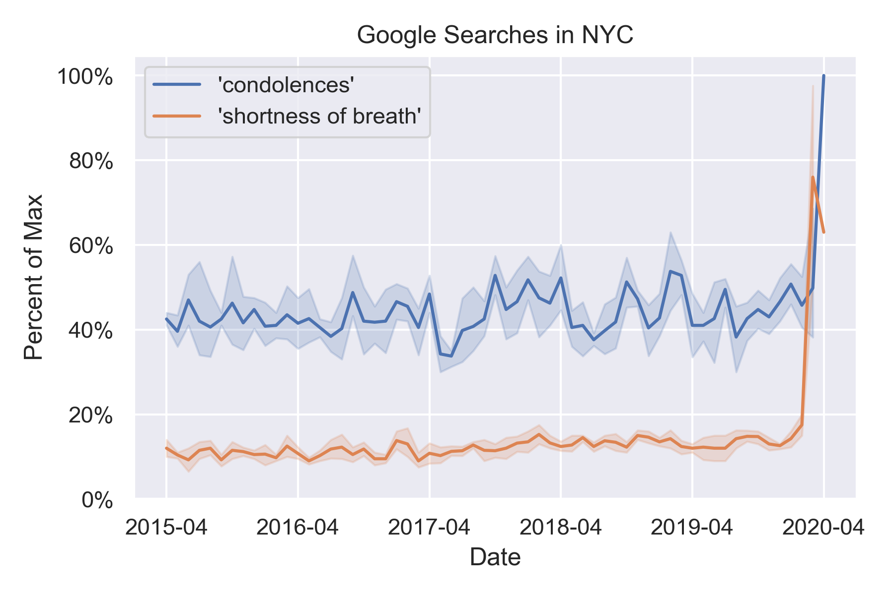

# COVID-19
Visualizations and other stuff for COVID-19

For this gif, I got the county population and COVID-19 cases data from USA facts and I got county land area data from the 2010 US census. I made the images via the pandas and seaborn libraries with python. There's clearly a relationship between population density and coronavirus cases (hence the 6ft away heuristic). Although the states included for the 'East Coast' clearly don't include *all* the states on the East coast because I wanted to weigh the graph towards the hardest hit states on the east coast, namely those around the tri-state area. 

 
 

For this plot, I got the data from google search trends (link below) and I made the graph using the pandas and seaborn libraries. The goal is to show the hockeystick-like rise in searches due to COVID-19. The lineplot points show the average and the error bands show the 95% CI for each month.

