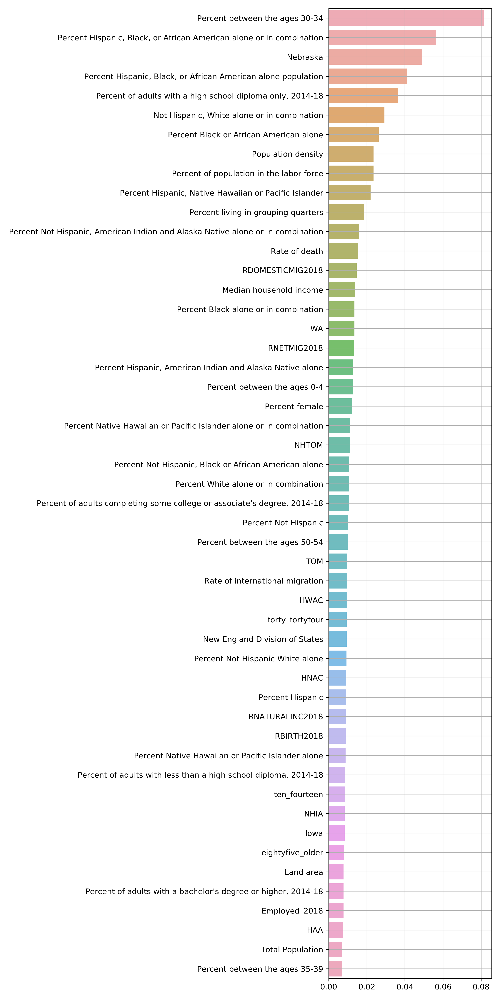

# COVID-19

## Using a machine learning model to predict coronavirus cases in a county from US census data

In this brief side project, I explore how the population density of a US county can be used to predict its prevalence of COVID-19, and how this relationship changes as the virus continues its march across urban, suburban, and rural counties alike. I also explore the relative changes in people's interests during the pandemic lockdown by looking at the changes in various google searches at the US epicenter of the crisis: NYC. 

## How does population density affect the prevalence of COVID-19? 

Presumeably, counties with low population densities, like rural counties, would seem to have a lower prevalence of COVID-19 because people are, quite literally, farther apart. Likewise, counties with high population densities, like urban counties, would seem to have a higher prevalence of COVID-19 because people are closer together, think the crowded NYC subway. 

#### Interpretation
We can see that there is indeed a positive relationship between coronavirus cases and population density, which adds weight to the 6 ft away heuristic, and agrees with what we would expect. It became more clear that there was a positive relationship as the number of cases increased, however, the relationship gradually diminished over time. I think this may be because, in the early stages of the crisis, the crowded and busy counties got hit first, however, as the virus spread everywhere, the entropy increased so to speak and it didn't matter so much whether a location was crowded or not, counties everywhere had the virus in similar amounts. 

I showed Seattle versus Manhattan because I clearly remember in the beginning of March walking around the streets of manhattan, going in the subway, etc. and nobody was wearing masks. At the time, Seattle Washington was known to have cases and so people may have been more careful there, and, I believe Seattle was locked down much earlier than NYC. 

Here we can see the evolving relationship across *all* US counties, not just ones in the northeast and west US states. 

#### State level data
(Instead of county level data)

Here we can see the relationship for all US states overall, and how that changes over time. 

 
 
 
 
 The relationship is quite strong. States with high population densities have a strong tendency to have many COVID-19 cases per capita. 

#### Methods and materials
I obtained the county population and COVID-19 cases data from USA facts and I obtained county land area data from the 2010 US census. I prepared the data with pandas, created the visualizations with matplotlib in python, and calculated the statistics using SciPy. I used https://ezgif.com/maker for converting from the pngs to the final gif. 

I chose the northeast and west states so that I would have more reliable sample sizes of COVID-19 cases. I also chose the states specifically so that the combined populations of the Northeast and West states would be roughly equal (51 plus or minus 1 million people). 

Pearson's correlation coefficient and the corresponding p-value were calculated for counties that had greater than 0.1 cases per 100,000 people. 

One of the saddest moments of making these graphs was when I updated the data and found that I had to increase the top limit of the y-axis to fit the much greater number of cases in a few of the counties. 

<!-- 
 
 

Here we can see the relationship across all US counties. I think it's less clear here because there could be a lot of counties with very small populations, and if those counties happen to have a lot of cases, they would have an enormous number of cases per capita without necessarily having a high population density. 

-->

 

## Coronavirus-related google searches in NYC

#### Interpretation

In this plot we can see that certain google searches became very common in NYC during the COVID-19 crisis. Perhaps the most dismal one is the rise in searches for 'condolences'. In fact, I first thought about checking the search data on 'condolences' when I myself was writing somebody a letter of condolences due to COVID-19. Because gyms were closed in the NYC lockdown, people may have googled 'pushups' so that they could properly get their workout done at home via pushups, instead of at the gym. 

#### Methods and materials

For this plot, I obtained the data from google search trends and prepared it using pandas. I made the graph with the confidence intervals using seaborn. 

