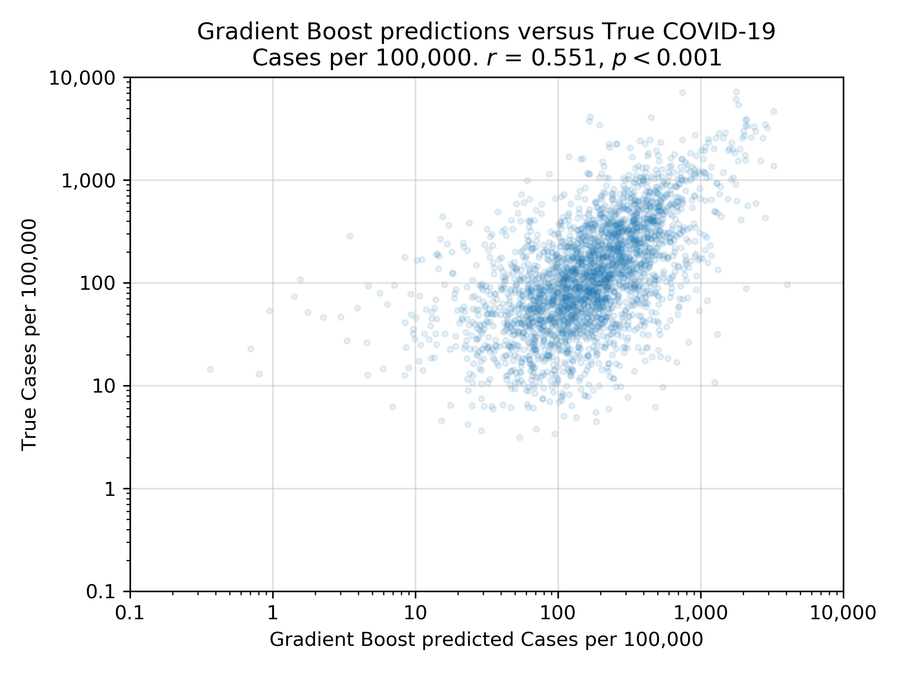
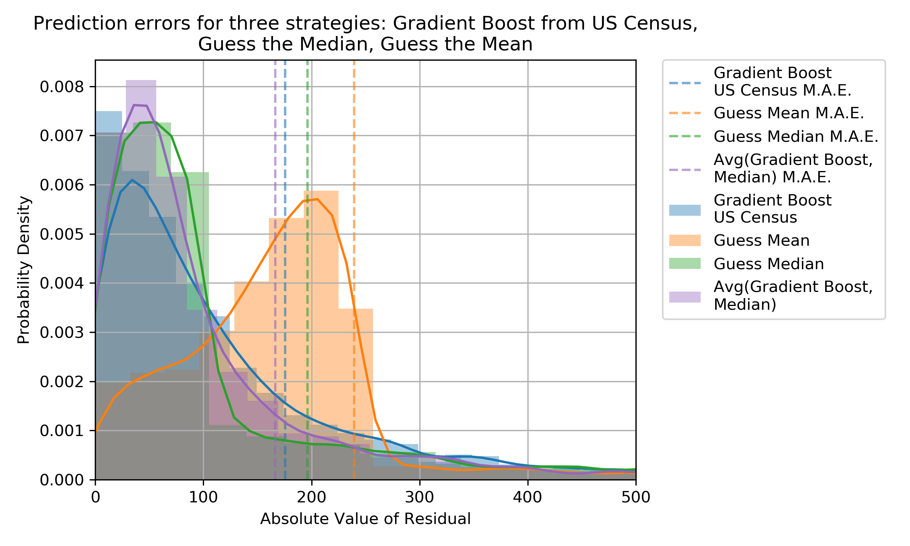
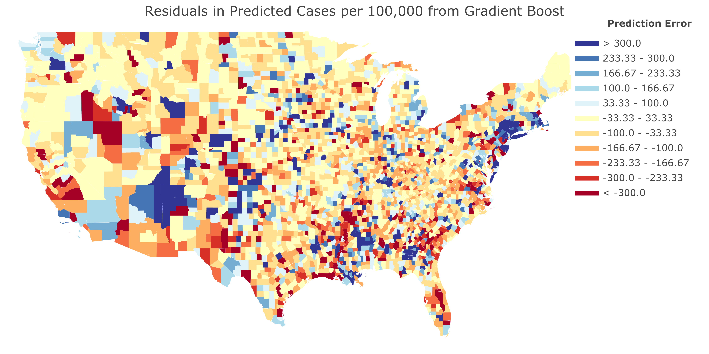
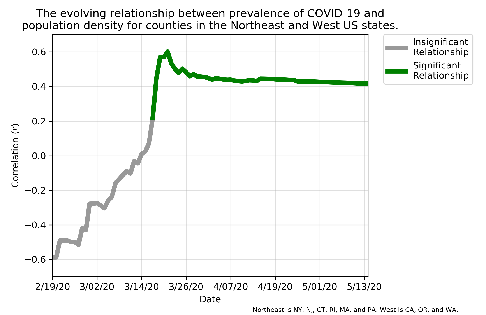
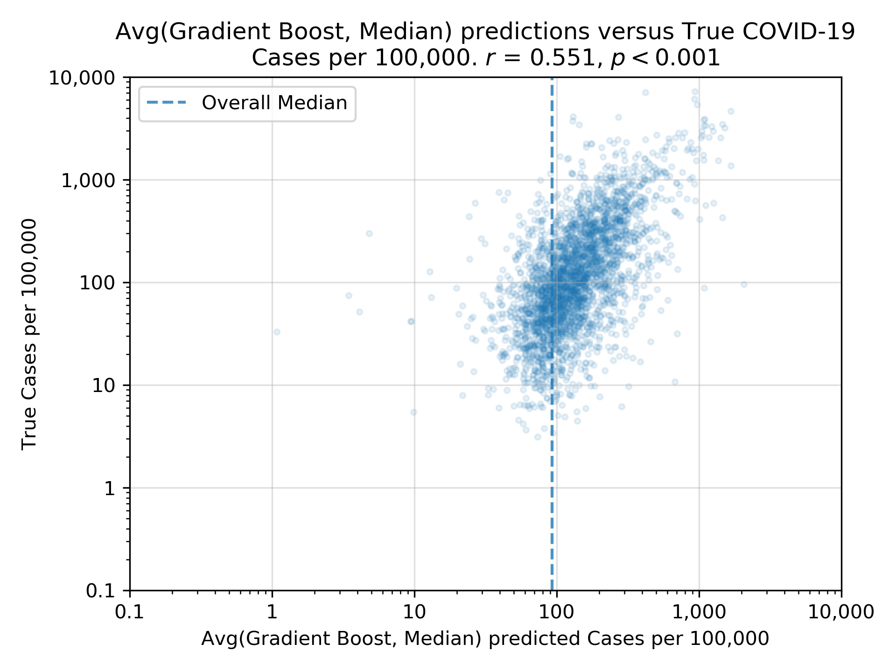
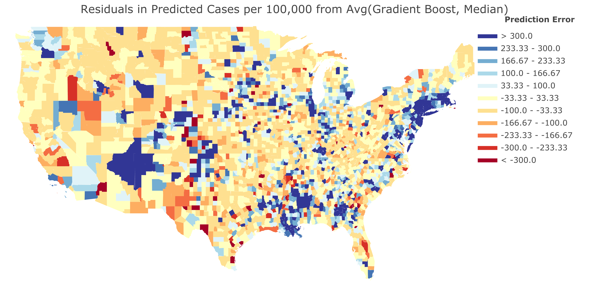

# COVID-19 ML and Visualizations

#### Table of Contents
1. [Machine Learning to predict COVID-19 cases](#ml)
2. [Visualizations](#visuals)
3. [Appendix](#ax)

## Using machine learning to predict COVID-19 cases within each US county from the 2018 US Census Estimates data  

Most recent COVID-19 confirmed cases data: May 16, 2020

In this project, I applied gradient boosted decision trees to 2018 US Census Estimates data to predict the number of confirmed COVID-19 cases per 100,000 within each US county. I then identified the counties with the biggest negative residuals, in other words, the counties for which the model most over-predicted the prevalence of COVID-19. These counties can then be considered the 'luckiest' counties, as they have fared much better than would be predicted from their US census data. Or perhaps, testing may need to be expanded in these counties, as they may have far more cases than presently reported. 

### Model Performance

For each county, the model was trained on all the other counties, and then made a prediction for the county. In other words, the model was cross-validated on every individual county. In this process there was no chance of data leakage. The model performs better than the simple strategy of guessing the mean and median cases per 100,000 from all the other counties. This fact is shown in the average absolute errors in the predictions from the model and those two simple strategies. The model, shown in blue, clearly has a lower mean absolute error (M.A.E.) than those simple strategies, shown in orange and green. Interestingly, the gradient boosted model was slightly improved by averaging it with the median cases per 100,000 of all the other counties, as shown in purple. 

The model clearly has predictive capability but isn't perfect. To check for any geographic bias in the prediction errors, I have shown a map of the prediction errors for each county in the continental US. Blue is where the model underpredicted, red is where the model overpredicted, and yellowish white is where the model was accurate. The overpredicted counties are shown in red because those are the counties where the model believes cases are much higher than presently reported. Perhaps those counties should be 'checked again', as the model suggests that they may be under-reporting cases. Likewise, the counties in blue are where the model predicted there would be far fewer cases than presently reported. 

### Most over-predicted counties 

Listed below are the top 30 counties for which the Gradient Boosted model expected to see far more cases than presently reported, suggesting that these counties may have more cases than presently reported. 

| County, State                  |   Prediction Error |
|:---------------------------------|---------------:|
| Forest County, Pennsylvania      |      -3950.66  |
| Greensville County, Virginia     |      -2412.21  |
| North Slope Borough, Alaska      |      -2378.68  |
| Wheeler County, Georgia          |      -1994.88  |
| Manassas city, Virginia          |      -1881.26  |
| Issaquena County, Mississippi    |      -1878.01  |
| Powell County, Montana           |      -1850.93  |
| Stewart County, Georgia          |      -1838.78  |
| Jones County, Texas              |      -1570.68  |
| Buena Vista County, Iowa         |      -1511.32  |
| DeKalb County, Missouri          |      -1286.27  |
| Lee County, Kentucky             |      -1265.57  |
| Emmet County, Iowa               |      -1248.64  |
| Union County, Florida            |      -1194.15  |
| Duplin County, North Carolina    |      -1173.87  |
| New York County, New York        |      -1106.6   |
| Ector County, Texas              |      -1047.72  |
| Petersburg city, Virginia        |      -1008.12  |
| Sevier County, Arkansas          |       -963.681 |
| Tunica County, Mississippi       |       -952.414 |
| San Francisco County, California |       -934.171 |
| Lincoln County, Colorado         |       -930.412 |
| Arlington County, Virginia       |       -898.588 |
| Greene County, North Carolina    |       -867.263 |
| Alexandria city, Virginia        |       -861.727 |
| Scott County, Iowa               |       -856.461 |
| Bailey County, Texas             |       -841.174 |
| New Castle County, Delaware      |       -838.501 |
| Dallam County, Texas             |       -830.803 |
| Johnson County, Nebraska         |       -818.163 |

(A list of all the residuals for every County for both the Gradient Boost as well as the Gradient Boost averaged with the median is provided in `both_residuals.csv` in the `public_data` folder.)

#### Most predictive features from the US Census

It is natural to ask what features of the US census data are most important in predicting the prevalence of COVID-19 within a county. Certainly, location is an important feature: cases per capita in New York are likely greater than cases per capita in Alaska. However, other features such as demographics, amount and type of population growth, employment, and education features are each important. Predictive features do not necessarily have a simple positive or negative association with the predictive variable. Because gradient boosting uses an ensemble of decision trees, a predictive feature can have both a positive *and* a negative association with the target variable, depending on the other features present. That is why it is impossible to provide the *direction* of the association each predictor variable has with the target variable: COVID-19 cases. 

## Visualizations of the relationship between population density and COVID-19, and Google search trends in NYC 

Here I explore visuals of how the population density of a US county can be used to predict its prevalence of COVID-19, and how this relationship changes as the virus continues its march across urban, suburban, and rural counties alike. I also explore the relative changes in people's interests during the pandemic lockdown by looking at the changes in various google searches at the US epicenter of the crisis: NYC. 

### How does population density affect the prevalence of COVID-19? 

Presumeably, counties with low population densities, like rural counties, would seem to have a lower prevalence of COVID-19 because people are, quite literally, farther apart. Likewise, counties with high population densities, like urban counties, would seem to have a higher prevalence of COVID-19 because people are closer together, think the crowded NYC subway. 

We can see that there is indeed a positive relationship between coronavirus cases and population density, which adds weight to the 6 ft away heuristic, and agrees with what we would expect. It became more clear that there was a positive relationship as the number of cases increased, however, the relationship gradually diminished over time. I think this may be because, in the early stages of the crisis, the crowded and busy counties got hit first, however, as the virus spread everywhere, the entropy increased so to speak and it didn't matter so much whether a location was crowded or not, counties everywhere had the virus in similar amounts. 

I chose the northeast and west states so that I would have more reliable sample sizes of COVID-19 cases. I also chose the states specifically so that the combined populations of the Northeast and West states would be roughly equal (51 plus or minus 1 million people). 

Pearson's correlation coefficient and the corresponding p-value were calculated for counties that had greater than 0.1 cases per 100,000 people. 

I showed Seattle versus Manhattan because I clearly remember in the beginning of March walking around the streets of manhattan, going in the subway, etc. and nobody was wearing masks. At the time, Seattle Washington was known to have cases and so people may have been more careful there, and, I believe Seattle was locked down much earlier than NYC. 

##### State level data on the relationship between population density and COVID-19
(Instead of county level data)

Here we can see the relationship for all US states overall, and how that changes over time. 

 
 
 
 
The relationship is quite strong. States with high population densities have a strong tendency to have many COVID-19 cases per capita. 

<!-- 
 
 

Here we can see the relationship across all US counties. I think it's less clear here because there could be a lot of counties with very small populations, and if those counties happen to have a lot of cases, they would have an enormous number of cases per capita without necessarily having a high population density. 

-->

 

### COVID-19 related google searches in NYC

It is clear that certain google searches became far more common in NYC as a result of the COVID-19 crisis. Perhaps the most dismal trend is the rise in searches for 'condolences'. In fact, I first thought about checking the search data on 'condolences' when I myself was writing somebody a letter of condolences due to COVID-19. Because gyms were closed in the NYC lockdown, people may have googled 'pushups' so that they could properly get their workout done at home via pushups, instead of at the gym. 

## Appendix 

## Machine Learning Appendix

### Averaging the Gradient Boost with guessing the median 

As shown in the [graph of prediction errors](#performance), the Gradient Boost model was slightly improved by averaging its prediction with the median cases per 100,000 of all the *other* n-1 counties. The dashed blue line in the plot below shows the *overall* median cases per 100,000 in all US counties. The predictions are squished inwards towards the dashed blue line and the mean absolute error is slightly reduced. 

## Visualization Appendix 

Here we can see the evolving relationship between population density and COVID-19 across *all* US counties, not just ones in the northeast and west US states. The strength of the relationship is reduced. 

